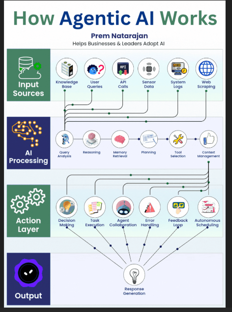

# 🗄️ Smart File Agent

- A tiny, educational demonstration of an agentic AI pipeline — no LLMs, no APIs, just pure Python.


---

# 🧠 Overview

Smart File Agent is a tiny, self‑contained demonstration of an agentic 
AI pipeline — built entirely in Python

It mirrors the architecture shown in the “How Agentic AI Works” diagram:

- Input Sources → file ingestion

- AI Processing → request analysis + planning

- Action Layer → tool execution (summarise, bulletify)

- Output → clean Markdown summary

This project is intentionally small and easy to understand.

---

# 📸 Screenshots

- Smart File Agent is a miniature implementation of the agentic‑AI pipeline shown below — it ingests a file, analyses the user’s request, plans the steps, executes tools, and produces a structured output exactly like the Input → Processing → Action → Output flow in the diagram.

---



---

# 🏗️ Project Structure
```
smart_file_agent/
│
├── smart_file_agent/
│   ├── __init__.py
│   ├── main.py
│   ├── agent/
│   │   ├── __init__.py
│   │   ├── agent_core.py
|   |   ├── logging_config.py
│   │   ├── ingestion.py
│   │   ├── processing.py
│   │   ├── tools.py
│   │   └── output.py
│
├── venv/
├── README.md
└── project_notes.txt
```

---

# 🧩 How It Works (Mapped to Agentic AI Architecture)

## Input Sources → ingestion.py
- Loads the file text
- Extracts metadata (name, size, extension)

## AI Processing → processing.py
- Analyses the user’s request
- Chooses a mode (summary or bullet summary)
- Plans the steps the agent should take

## Action Layer → tools.py
- Implements two tiny rule‑based tools:
- summarise_text() → extracts first sentence, longest sentence, keywords
- bulletify() → converts sentences into bullet points

## Agent Orchestration → agent_core.py
- Runs the pipeline and executes each planned step in order
- Produces a structured result dictionary

## Output Layer → output.py
- Formats the final Markdown summary

---

# ▶️ Running the Agent
From the project root:

```Bash
python -m smart_file_agent.main
```
You’ll be prompted for:
- File path
- What you want the agent to do

## Example:
Enter file path: (**File path of any text document you have**)
What would you like to do? **bulletify**

## 💬 Supported Prompts
You can speak to the agent naturally.
Here are some example prompts:

## Summaries
- summarise this
- give me a summary
- summarise the file
- what is this file about

## Bullet summaries
- bulletify
- give me bullet points
- turn this into bullets
- bullet summary please

The agent detects the intent and chooses the correct mode.

## 🧪 Example Output

- AGENT OUTPUT

## Summary of project_notes.txt
**Mode:** bullet_summary
**Steps:** extract_text, summarise, bulletify

- Summary:
- Opening idea: ...
- Key detail: ...
- Keywords: ...

---

# 🎯 Why This Project Exists
This project demonstrates:

- how agentic systems work internally

- how to build a reasoning → planning → action pipeline

- how to structure a Python agent project

- how to simulate LLM behaviour without external dependencies

- It’s intentionally tiny, readable, and educational.

---

# 🛣️ Roadmap Features

- [ ] Add a reasoning trace (“Thought → Action → Result”)

- [ ] Add a memory system

- [ ] A reasoning trace (LLM‑style)

- [ ] Add a tool registry

- [ ] Add a FastAPI interface

---

# 📝 Notes 
- It was enjoyable to build this. If you have any ideas on how to collaborate and 
improve this project please let me know.

---

* **Built by Roy Peters** 😁[](https://linkedin.com/in/roy-p-74980b382/)